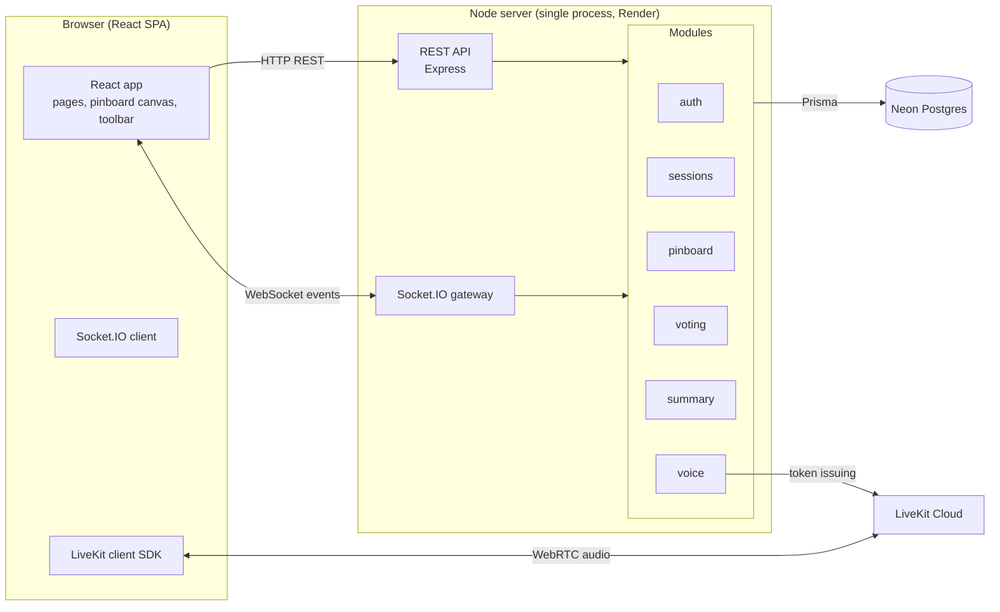
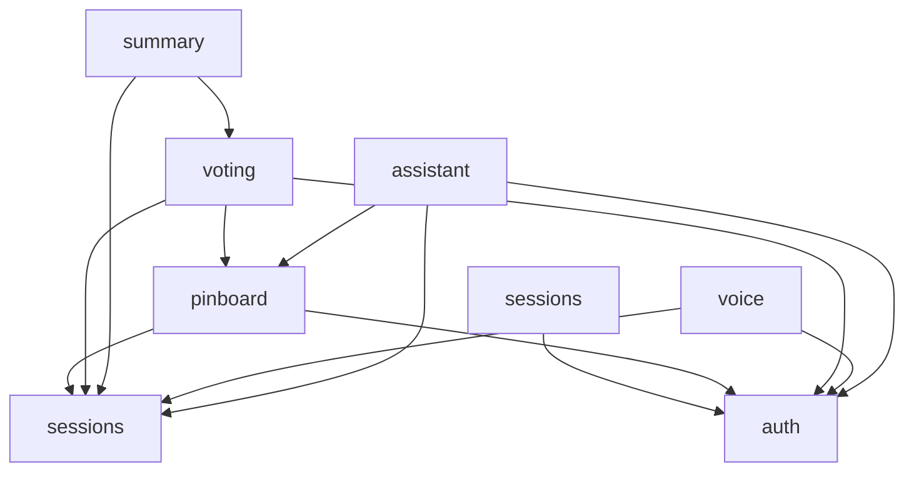

# RoundTable — Architecture & Repository Layout

> One deployable app (modular monolith), split internally so 7 engineers can work in parallel without conflicts.

## 1. The big picture



Three moving parts only:

1. **The app server** — one Node process serving the built React frontend *and* the REST API *and* WebSocket events. Deployed to Render.
2. **Neon Postgres** — all persistent data.
3. **LiveKit Cloud** — voice audio only (WebRTC). Our server merely issues join tokens.

## 2. Modular monolith: what that means here

One process, but strict internal boundaries. Each **module**:

- Lives in its own folder under `apps/server/src/modules/<name>/` with its own routes, services, and Prisma models (schema sections are commented per module).
- Owns its database tables. Other modules **never** query another module's tables directly.
- Exposes a typed public surface (`index.ts`) that other modules may import. Everything else is private.
- Communicates with other modules via direct calls to their public surface (same process), never via HTTP-to-itself.

**Why this works for us:** each module is a natural ticket cluster → one or two engineers own a module end-to-end; git merge conflicts become rare; and if we ever need to scale, a module can be extracted into its own service.

### Module map

| Module | Owns | Public surface (used by others) |
| --- | --- | --- |
| `auth` | Users, signup/login, JWT verification, `requireAuth` middleware | `requireAuth`, `getCurrentUser(req)` |
| `sessions` | Session CRUD, questions/agenda, membership, invite codes, session state machine (lobby→discussion→voting→results→ended) | `getSession(sessionId)`, `requireLeader(sessionId, userId)`, `getActiveQuestion(sessionId)`, state-change emitter |
| `pinboard` | Proposals (sticky/drawing/diagram artifacts), positions, reactions, extend-linkage | `listProposals(questionId)`, `createProposal(...)`, event emitters |
| `tools` *(frontend-only concern)* | Sticky note / drawing / diagram editors in React; produces artifact payloads consumed by `pinboard` | — (frontend module under `apps/web/src/features/tools/`) |
| `voting` | Voting rounds, shortlists, ballots, tallies, winners | `startVotingRound(...)`, `closeRound(...)` |
| `summary` | Session summary generation + storage of per-question outcomes | `buildSummary(sessionId)` |
| `voice` | LiveKit room lifecycle, token issuance | `issueToken(sessionId, user)` |
| `assistant` | Per-user LLM config (encrypted), context assembly, tool-calling chat loop, artifact generation | `getLLMConfig(userId)`, `buildSessionContext(sessionId)` |

Dependency rule (arrows may only point this way):



No cycles. If two modules seem to need each other, invert: raise an event or move the shared concept down into the lower module.

## 3. Data model (Postgres via Prisma)

```
User          id, email, passwordHash, displayName, createdAt
Session       id, code, title(focus), leaderId→User, status(lobby|active|ended), createdAt, endedAt
Question      id, sessionId→Session, text, position(int), status(pending|discussion|voting|answered|skipped)
SessionMember id, sessionId→Session, userId→User, joinedAt        (unique sessionId+userId)
Proposal      id, questionId→Question, authorId→User, type(sticky|drawing|diagram),
              artifactJson(jsonb), x, y, extendsProposalId?→Proposal, createdAt
Reaction      id, proposalId→Proposal, userId→User, emoji             (unique proposalId+userId+emoji)
VotingRound   id, questionId→Question, status(open|closed), createdAt, closedAt
Vote          id, roundId→VotingRound, voterId→User, proposalId→Proposal (unique roundId+voterId)
Answer        id, questionId→Question(unique), winningProposalId→Proposal, decidedAt
Summary       id, sessionId→Session(unique), contentJson(jsonb), createdAt
UserLLMConfig id, userId→User(unique), baseUrl, apiKeyEncrypted, model, updatedAt
```

Notes:
- `artifactJson` shape depends on proposal type — sticky `{text,color}`, drawing `{svg}`, diagram `{nodes:[],edges:[]}`. Typed in `packages/shared`.
- Deleting a proposal that has reactions/votes/extends children: MVP = soft delete flag `deletedAt` on Proposal.

## 4. Realtime design (Socket.IO)

- **Rooms:** every connected socket joins `session:{sessionId}` after auth + membership check. All session events broadcast to that room.
- **Authoritative server:** the browser never mutates shared state directly. Clients send intents (`proposal:create`), the server validates (membership, phase, ownership), persists, then broadcasts the resulting fact (`proposal:created`). This avoids sync bugs entirely.
- **State snapshot:** on joining a session socket room the server sends `session:state` (current phase, active question, all proposals, votes status). Even though late-join is a stretch goal, this endpoint exists from day one because refreshes happen.

### Event catalogue (shared types live in `packages/shared/src/events.ts`)

| Direction | Event | Payload | Notes |
| --- | --- | --- | --- |
| C→S | `member:join` | `{sessionId}` | joins socket to room, triggers snapshot |
| S→C | `session:state` | full snapshot | on join/reconnect |
| S→C | `member:joined` | `{user}` | presence list update |
| S→C | `session:phase` | `{questionId, phase}` | leader-driven transitions |
| S→C | `session:skipped` | `{questionId}` | leader skipped |
| C→S | `proposal:create` | `{type, artifactJson, x, y, extendsProposalId?}` | validated vs phase=discussion |
| S→C | `proposal:created` | `{proposal}` | broadcast |
| C→S | `proposal:update` | `{id, artifactJson?, x?, y?}` | author-only, phase=discussion |
| S→C | `proposal:updated` | `{proposal}` | broadcast |
| C→S | `proposal:delete` | `{id}` | author-or-leader |
| S→C | `proposal:deleted` | `{id}` | broadcast |
| C→S | `reaction:toggle` | `{proposalId, emoji}` | any member, discussion phase |
| S→C | `reaction:toggled` | `{proposalId, emoji, counts, byUser}` | broadcast |
| C→S | `vote:cast` | `{roundId, proposalId}` | one ballot per user |
| S→C | `vote:progress` | `{roundId, votedCount, totalVoters}` | no vote contents |
| S→C | `vote:result` | `{questionId, winnerProposalId}` | when round closes |

## 5. REST API surface

REST handles non-realtime concerns (all prefixed `/api`):

| Area | Endpoints |
| --- | --- |
| auth | `POST /api/auth/signup`, `POST /api/auth/login`, `GET /api/auth/me`, `PATCH /api/users/me` |
| sessions | `POST /api/sessions` (with questions), `GET /api/sessions/mine`, `GET /api/sessions/:id`, `PATCH/DELETE /api/sessions/:id`, `POST /api/sessions/:id/join {code}` |
| summary | `GET /api/sessions/:id/summary` |
| voice | `POST /api/sessions/:id/voice-token` |
| assistant | `PUT /api/me/llm-config {baseUrl, apiKey, model}` (write-only; GET returns config *without* key), `POST /api/me/llm-config/test`, `POST /api/sessions/:id/assistant/chat` (SSE stream) |

Phase transitions, proposals, reactions, and votes go over WebSockets (see §4). Assistant chat streams over **SSE** because it's a request-scoped, one-directional response — no need for a socket room per private chat.

## 6. Monorepo layout

```
/
├── apps/
│   ├── web/                    # React SPA (Vite)
│   │   └── src/
│   │       ├── features/       # mirrors backend modules: auth/, sessions/, pinboard/, tools/, voting/, summary/, voice/
│   │       ├── components/ui/  # shared dumb components (Button, Modal…)
│   │       ├── lib/            # api client, socket client, livekit hook
│   │       └── App.tsx         # router + providers
│   └── server/                 # Express + Socket.IO
│       └── src/
│           ├── modules/        # auth/, sessions/, pinboard/, voting/, summary/, voice/, assistant/
│           │                   # (tools is frontend-only under apps/web/src/features/tools/)
│           ├── realtime/       # Socket.IO wiring, room management, event dispatch
│           └── index.ts        # boots http + ws + serves ../web/dist in production
├── packages/
│   └── shared/                 # TS types: domain entities, API DTOs, Socket.IO event maps, zod schemas
├── docs/
├── .github/workflows/          # CI
├── package.json                # npm workspaces root
└── turbo.json                  # (optional) task orchestration
```

**Key convention:** frontend `features/` folders mirror backend modules. If you're the "voting person", your world is `apps/server/src/modules/voting`, `apps/web/src/features/voting`, and the voting parts of `packages/shared`. You can complete tickets without touching other people's files.

## 7. Cross-cutting conventions

- **Language:** TypeScript everywhere. `strict: true`.
- **Validation:** zod schemas defined once in `packages/shared`; used for REST bodies, socket payloads, and form validation.
- **Styling:** Tailwind CSS v4. No component library for MVP; build a tiny `components/ui`.
- **Git:** trunk-based. Short-lived branches named `<module>/<kebab-desc>` e.g. `voting/cast-ballot`. Squash-merge PRs. PRs require 1 review + passing CI.
- **Commits:** Conventional Commits (`feat(voting): …`) — enables readable changelogs.
- **Testing:** Vitest unit tests per module (pure logic like state machine, tally rules); Playwright smoke test of happy path from Week 3 onward.
- **Lint/format:** ESLint flat config + Prettier, enforced in CI.
- **Env/config:** `.env.example` committed, real `.env` ignored. Server config loaded via one `env.ts` module using zod validation at boot.

## 8. Key technical decisions & gotchas

1. **Serving the SPA from the same Express process** avoids CORS entirely in production; in dev, Vite's proxy forwards `/api` and `/socket.io` to the server port.
2. **Socket auth:** client passes JWT in the handshake (`auth.token`); server rejects unauthenticated/membership-less joins before adding to rooms.
3. **Leader authority is enforced server-side** — hiding buttons in the UI is cosmetic only; every mutating event checks role + current phase.
4. **Vote privacy:** individual ballots are never broadcast; only aggregate progress. Results computed server-side on close.
5. **Drawings/diagrams are stored as JSON/SVG strings** — no file uploads in MVP, keeping infra minimal. Size-limit artifacts (~100KB) at validation time.
6. **Reconnects:** Socket.IO reconnect + `session:state` resnapshot makes refreshes safe; LiveKit SDK auto-reconnects audio independently.
7. **Render free tier sleeps** after ~15 min idle; first request pays a cold start (~30s). Acceptable for MVP demo; document it.
8. **AI Assistant isolation:** each user's chat is private — assistant events are emitted to the single requester's socket/HTTP connection only, never broadcast to the session room. The agent can *read* shared session state but its outputs reach the pinboard only via an explicit user-driven propose (F37), reusing the normal proposal pipeline so ownership/validation stay consistent.
9. **LLM provider abstraction:** the assistant talks to any OpenAI-compatible `/chat/completions` endpoint using the user's stored config. Tool-calling loop lives server-side in the `assistant` module; API keys are AES-encrypted at rest and never sent back to the client after save.
